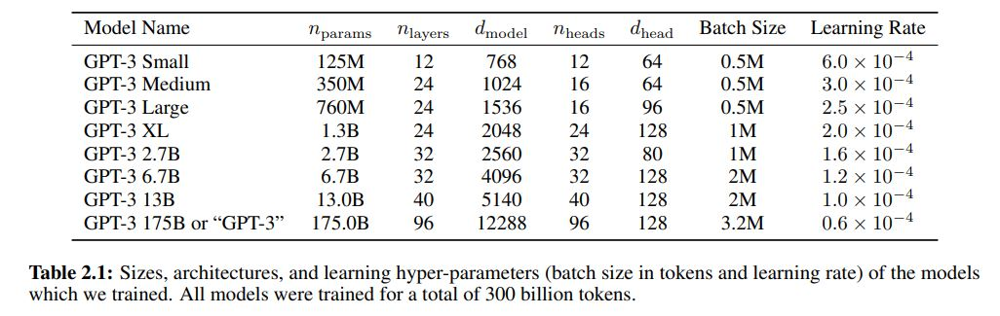

# gpt-3-for-pascal
The paper [Language Models are Few-Shot Learners](https://arxiv.org/abs/2005.14165) shows a neural network architecture based on a stack of transformer decoder modules. The table 2.1 from this paper shows a number of GPT-3 based architectures:
<p></img></p>

As per table above, the **GPT-3 Small** is composed by:
- 12 transformer decoders,
- 12 heads, 
- 768 hidden dimensions (64 hidden dimensions per head) and 
- 3072 intermediate dimensions (768 hidden dimensions times 4).

With [CAI Neural API](https://github.com/joaopauloschuler/neural-api), a neural network model similar to **GPT-3 Small** can be implemented with:
```
  var
    CntLayer: integer;
  begin
    Result := THistoricalNets.Create();
    Result.AddLayer([
      TNNetInput.Create(pContextSize, 1, 1),
      TNNetTokenAndPositionalEmbedding.Create(pVocabSize, pEmbedDim),
      TNNetPointwiseConvLinear.Create({hidden dimensions=}768),
      TNNetSignedSquareRoot1.Create()
    ]);
    for CntLayer := 1 to {Layers=}12 do
    begin
      Result.AddTransformerBlockCAI( {Heads=}12, {intermediate dimensions=}4*768, {NoForward=}true, {HasNorm=}true, false);
    end;
    Result.AddLayer([
      TNNetPointwiseConvLinear.Create(pVocabSize, 1),
      TNNetPointwiseSoftMax.Create(1)
    ]);
  end;
```
At this point in time, there is no efficient GPU implementation for pascal. Although the model name is **GPT-3 Small**, training this model requires large amounts of RAM and CPU power. In the case that you would like to see the magic (training) happen in front of your eyes with the [Tiny Stories Dataset](https://huggingface.co/datasets/schuler/TinyStories4Pascal), this model can be run very slowly on google colab **High RAM** CPU based environment:  [GPT-3 Small for Pascal](https://colab.research.google.com/github/joaopauloschuler/gpt-3-for-pascal/blob/master/notebooks/gpt-3-for-pascal-v1.ipynb)  [](https://colab.research.google.com/github/joaopauloschuler/gpt-3-for-pascal/blob/master/notebooks/gpt-3-for-pascal-v1.ipynb).
